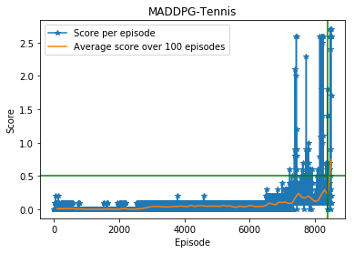

### MA Actor-Critic
#### MADDPG
The concept of the multi agent deep determenstic policy gradient (MADDPG) concept is centeralized training and decentralized execution as shown in the following figure.

Each agent has its own actor and critic networks, but they share expereinces. This method is applicable for cooperative, mixed or as in this case competitive interaction(two agents). 
##### Algorithm

- Receive the initial state x
- For each episode
    - Initialize the noise process for exloration (Ornstein–Uhlenbeck is used)
    - For each time step
        - For each agent
            - Select an action w.r.t the current agent policy and exploration.
        - Execute the actions and observe the reward and the new state.
        - Store (x(states), a(actions), r(rewards), x'(next states)) in the replay buffer D
        - The nex states becomes the states (preparing for the next iteration)
        - For each agent(i)
            - Sample a random minibatch
            - Set y = ri + Gamma * the target Q value function in state(x' (next states)) and taking actions a' computed by the agent policy
            - Update the critic by minimizing the mean squared erorr between the expected and the target Q value functions
            - Update the actor using the sampled policy gradient
            - Update the target network parameters for each agent

The DDPG explanation can be found in the next section.
Refrences:
[MADDPG Paper](https://arxiv.org/abs/1706.02275)
#### DDPG
DDPG stands for deep determenstic policy gradient. DDPG is an off-policy method meaning that the target policy is different from the behavioral policy. It tries to learn Q function(critic) and a policy(actor). The policy is parameterized functoin reperesented by a nueral network that maps a state to a specific action(hence the name determenestic). The critic predicts how good is the choice of action a taken in state s. A copy of actor/critic networks representing the Target networks which are used as error measure to improve the stability of the learning process. The imporvment of the stability of the learning process is a result of the slow change expereniced by the target networks from the soft update of the weights. 
The learning algorithm assumes independent samples from the environment, therefore, to ensure an uncorrelated experinces, a replay buffer is used to store Transitions(state, action, reward, next_state, terminal(bool)). When learning a batch is uniformly sampled from the buffer. 
To overcome the exploration problem, a noise added to the policy function. The noise comes from the Ornstein-Uhlenbeck process[[1](https://en.wikipedia.org/wiki/Ornstein%E2%80%93Uhlenbeck_process)].
Refrences:
[DDPG paper](https://arxiv.org/pdf/1509.02971.pdf)
[Target networks intuition](https://stackoverflow.com/questions/54237327/why-is-a-target-network-required/54238556#54238556)
##### Algorithm
- Initialize the actor/critic networks weights 
- Hard copy the weights to the target networks weights
- Initialize the replay buffer
- for each episode:
    * Initialize the random process for action exploration
    * Receive initial observation state
    * for each time-step:
        * select an action according to the current policy and exploration noise
        * exceute the action and observe the transition
        * store the transition(state, action, reward, next_state, terminal(bool))
        * sample a random mini-batch of N transition from the replay buffer
        * set y = reward + gamma * target Q value function in state s' (next state) given action a chosen from the actor function.
        * update the critic by minimizing the loss L = 1/N sum of (y - the Q value function in state s given action a)
        * update the actor policy using the sampled policy gradient
        * sofe update the target networks
        
Refrences:
[DDPG paper](https://arxiv.org/pdf/1509.02971.pdf)
##### MADDPG Networks
For each agent
* Actor
    |   | Layer | In  | Out |
    |---|------|-----|-----|
    | 1 | FC1  | 24  | 256 |
    | 2 | BN1  | 256 | 256 |
    | 3 | ReLU | 256 | 256 |
    | 4 | FC2  | 256 | 128   |
    | 5 | ReLU | 128 | 128 |
    | 6 | FC3  | 128 | 2   |
    | 7 | Tanh | 2   | 2   |

* Critic

    |   | Layer | In    | Out |
    |---|------|-------|-----|
    | 1 | FC1  | 48    | 256 |
    | 2 | ReLU | 256   | 256 |
    | 3 | BN1  | 256   | 256 |
    | 4 | FC2  | 256+4 | 256 |
    | 5 | ReLU | 256   | 256 |
    | 6 | BN2  | 256   | 256 |
    | 7 | FC3  | 256   | 1   |

##### Hyperparmeters
* Networks:
    * Initilization:
        The FC3 weights in all nets are initialized from a uniform distribution with bounds (-0.003, 0.003)
    * Hidden layers:
        *  Actor:
            - Fc1 units: 256, Fc2 units: 128
        * Critic:
            - Fc1 units: 256, Fc2 units: 256
* Replay buffer:
    Buffer size: 100,000
    learn after: 10,000 step
* Training:
    Episodes: 50000 (or till the environment is solved(8500))
    Max. steps per episode: 4000
    Critic learning rate: 0.001
    Actor learning rate: 0.0001
    Gamma (discount factor): 0.999
    Tau (Interpolation factor): 0.0005
    Batch size: 256
    Update: every 4 steps
##### Result

8500 episodes needed to solve the environment.   

###### Future work
* Prioritized experience replay
* Extend the MADDPG with the suggested approach in the MADDPG paper which is suitable for our case(competitve setting) and that is to use an ensemble of policies for each agent to improve the robustness. 
more information can be found in section 4.3  [here](https://arxiv.org/abs/1706.02275)